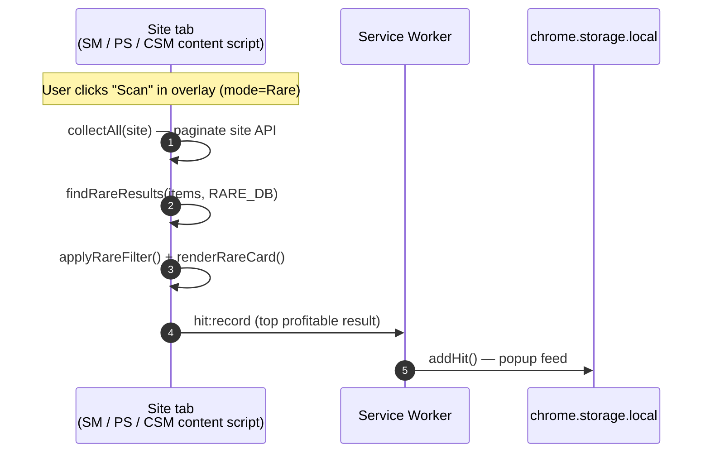
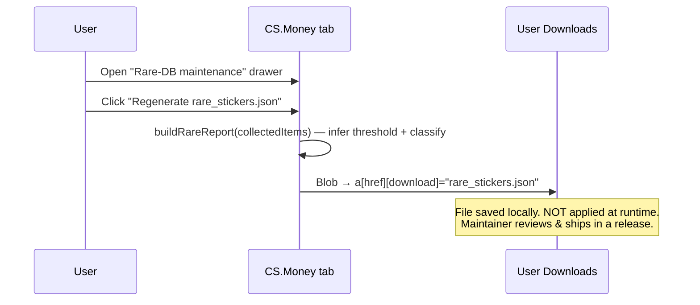

# Architecture

> This file fills in as features land. v0.1 was foundation; v0.2 wires the
> SkinsMonkey ↔ CSFloat data flow that is the most complex piece.

## Layout

```
src/
├── background/service-worker.ts     # MV3 SW — message router, cross-tab orchestration
├── content/                         # one entry per site (matches in manifest.config.ts)
│   ├── skinsmonkey.ts               # v0.2 Arbitrage scanner + v0.3 Rare
│   ├── csfloat.ts                   # v0.2 Arbitrage oracle
│   ├── pirateswap.ts                # v0.3 Rare
│   └── csmoney.ts                   # v0.3 Rare + DB regenerator
├── popup/                           # toolbar icon UI
└── modules/
    ├── shared/                      # OverlayShell, ui primitives, storage, messaging, fmt, tokens
    ├── arbitrage/                   # scanner, analyzer, score, csf-url, types
    └── rare/                        # finder (SM/PS), csmoney, rare-data, types
```

## Modules wired vs dormant per phase

| Module                        | First wired in         |
| ----------------------------- | ---------------------- |
| `modules/shared/*`            | v0.1 (popup + overlay) |
| `modules/arbitrage/*`         | v0.2 ✅                |
| `modules/rare/*`              | v0.3 ✅                |
| `modules/oracles/steam.ts`    | v0.4                   |
| `modules/oracles/skinport.ts` | v0.5                   |

## Data flow — Arbitrage (v0.2, wired)

```mermaid
sequenceDiagram
  autonumber
  participant SM as SkinsMonkey tab<br/>(content/skinsmonkey.ts)
  participant SW as Service Worker<br/>(background/service-worker.ts)
  participant CSF as CSFloat tab<br/>(content/csfloat.ts)
  participant Store as chrome.storage.local

  Note over SM: User clicks "Scan" in overlay
  SM->>SM: scanner.scanAll() — pages /api/inventory with CSRF
  SM->>SM: applyFilter() + buildExportPayload()
  SM->>SW: arbitrage:start { payload }
  SW->>Store: setPendingArbitrage(payload)
  SW->>CSF: chrome.tabs.create / update (focus CSFloat)

  CSF->>CSF: createOverlay(mode=arbitrage)
  CSF->>SW: arbitrage:ready
  SW->>Store: getPendingArbitrage()
  alt payload &lt;30 min old
    SW->>CSF: arbitrage:payload { payload } (chrome.tabs.sendMessage)
  else expired
    SW-->>CSF: { ok:false, error:"pending payload expired" }
  end

  CSF->>CSF: analyzer.runAnalysis(items) — fetch CSFloat /api/v1/listings per item
  CSF->>CSF: scoreItem() + renderItemCard(hot/warm/neutral)
  CSF->>SW: arbitrage:result { rows[] }
  SW->>Store: addHit() × n  (popup "Today's hits" feed)
```

### Message taxonomy

Defined in `modules/shared/messaging.ts`:

| Type                | Direction    | Payload                          | Purpose                                         |
| ------------------- | ------------ | -------------------------------- | ----------------------------------------------- |
| `arbitrage:start`   | SM → SW      | `{ payload: ExportPayload }`     | Hand off scanned items, open CSFloat tab.       |
| `arbitrage:ready`   | CSF → SW     | _none_                           | Announce overlay mounted; ask for payload.      |
| `arbitrage:payload` | SW → CSF tab | `{ payload: ExportPayload }`     | Forward pending payload via `tabs.sendMessage`. |
| `arbitrage:result`  | CSF → SW     | `{ rows: HitRow[] }`             | Final scored rows → "Today's hits" feed.        |
| `hit:record`        | any → SW     | `{ site, name, sub, profitUsd }` | Ad-hoc hit (not driven by an analysis loop).    |

### Stale payload guard

The SW stores `pending_arbitrage` with a `storedAt` timestamp. On
`arbitrage:ready` the SW checks `Date.now() - storedAt > 30 min` and, if
stale, clears the entry and replies with an error — the user just kicks off
a new scan on SkinsMonkey.

## Why service worker matters

- **CORS:** certain APIs (Steam priceoverview, future v0.4) cannot be called
  from arbitrary origins. The SW has the `host_permissions` and can fetch
  cross-origin.
- **Tab orchestration:** opening/focusing the CSFloat tab in response to a
  scan happens from a SW message handler — content scripts cannot call
  `chrome.tabs.create` directly with `tabs` permission alone but can ask the
  SW to do it on their behalf.
- **Single writer for hits:** the popup reads from `chrome.storage.local`,
  the SW writes. Content scripts never `addHit()` directly — they emit
  `arbitrage:result` or `hit:record` and the SW funnels.

## Data flow — Rare (v0.3, wired)

The Rare mode is single-site by design: each tab scans its own inventory
endpoint, matches against the bundled rare_stickers DB, and renders locally.
There is **no cross-tab routing**, no SW state, no payload hand-off. The SW
only sees a single `hit:record` per scan (the top profitable result, fed
into the popup feed).



### Rare DB regeneration (CS.Money only)

CS.Money is the source of truth for the rare-sticker DB. The overlay
includes a `<details>` drawer with a "Regenerate rare_stickers.json"
button that fires this local flow:



### Mode mutex

`storage.activeMode` is `'arbitrage' | 'rare' | null`. The popup is the
only UI that sets it; every content script reads it via
`isModeActive(mode)` and re-evaluates on `watchSettings()`. Sites that
don't support a given mode (CSFloat for Rare, PirateSwap/CS.Money for
Arbitrage) simply don't mount an overlay when their mode is inactive.

The SkinsMonkey content script supports both modes and switches between
them when the user flips the popup — the old overlay is destroyed (with
its in-flight scan aborted) and the matching one is mounted.

## CSS isolation

Overlay class names use the `sh-` prefix and the root container declares
`all: initial` to reset inherited styles from the host page. See
`modules/shared/tokens.ts` for the full CSS string (kept as a TS export so
content scripts can inject it without a bundler chunk).

## Edge cases (covered in code, listed for posterity)

| Situation                                                  | Handling                                                                                    |
| ---------------------------------------------------------- | ------------------------------------------------------------------------------------------- |
| User opens SM not logged in (no CSRF)                      | Scan button errors with "No CSRF token detected — log in and reload."                       |
| User clicks Scan with CSFloat tab on `/profile`            | SW focuses the existing tab without redirect; CSF script loads on every CSFloat URL.        |
| `/api/inventory` returns 429                               | `scanAll()` retries up to 3× per page with 600ms backoff; aborts after 3 consecutive fails. |
| User closes CSFloat tab mid-analysis                       | Analyzer's `isAborted` flag becomes implicit (no tab). Payload TTL (30 min) cleans up.      |
| CSFloat overlay loaded but no pending payload (cold start) | Overlay shows "Waiting for items from SkinsMonkey…" idle state; Refresh resends `:ready`.   |
| User flips popup mid-scan                                  | Old overlay's scan state is aborted; new overlay mounts cleanly (separate state per mode).  |
| User clicks Regenerate on CS.Money without collecting yet  | Button disabled until first successful scan; status text explains.                          |
| PirateSwap visited with activeMode='arbitrage'             | Overlay doesn't mount. `console.debug('[Skinsight] loaded on pirateswap')` only.            |
| Rare DB load fails (web_accessible_resources misconfig)    | `findRareResults` rejects with the fetch error; overlay status shows it.                    |
