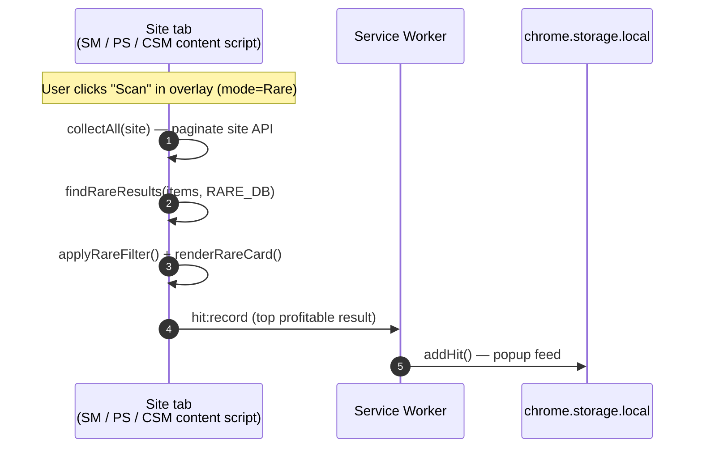
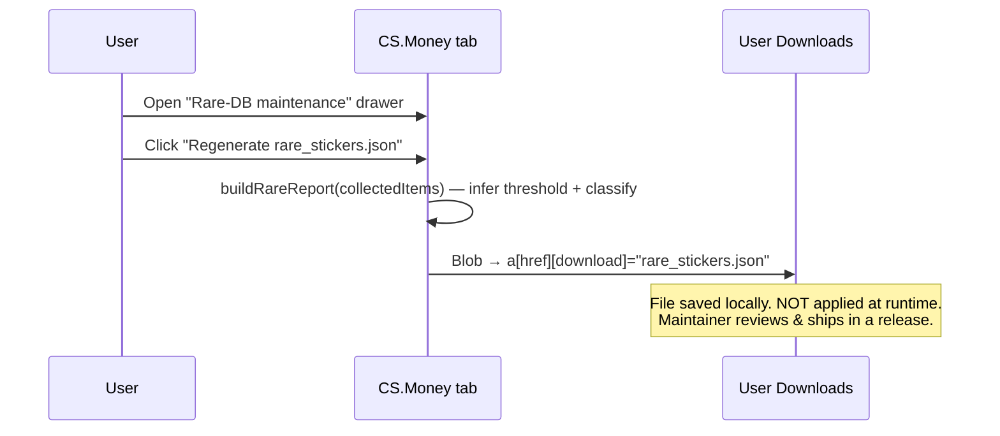

# Architecture

> This file fills in as features land. v0.1 was foundation; v0.2 wires the
> SkinsMonkey ↔ CSFloat data flow that is the most complex piece.

## Layout

```
src/
├── background/service-worker.ts     # MV3 SW — message router, cross-tab orchestration, onInstalled
├── content/                         # one entry per site (matches in manifest.config.ts)
│   ├── skinsmonkey.ts               # v0.2 Arbitrage scanner + v0.3 Rare
│   ├── csfloat.ts                   # v0.2 Arbitrage oracle
│   ├── pirateswap.ts                # v0.3 Rare
│   └── csmoney.ts                   # v0.3 Rare + DB regenerator + v0.7 overpay dump
├── popup/                           # toolbar icon UI (+ Pix QR/donate, options link)
├── options/                         # v0.7 options page (language + default mode)
├── welcome/                         # v0.7 first-install onboarding tab
└── modules/
    ├── shared/                      # overlay, ui, storage, settings, messaging, fmt, tokens,
    │                                #   throttle, virtual-list, i18n, overpay, debug
    ├── arbitrage/                   # scanner, analyzer, score, csf-url, types
    ├── rare/                        # finder (SM/PS), csmoney, rare-data, remote, render, types,
    │                                #   pattern-finder, pattern-data, fade, render-pattern (v0.9)
    └── oracles/                     # steam, steam-ui (per-item Steam Market price)
```

Build-time asset scripts (`scripts/*.mjs`, run via `prebuild`): `build-rare-data`
(slim rare DB), `build-icons` (per-size PNGs from SVG), `build-pix-qr`
(`public/pix-qr.svg` from `src/modules/shared/pix.json`). Store-listing strings
live in `public/_locales/{en,pt_BR}` (manifest `__MSG__`); the runtime UI uses
`modules/shared/i18n.ts` instead (see "Internationalization" below).

## Modules wired vs dormant per phase

| Module                      | First wired in          |
| --------------------------- | ----------------------- |
| `modules/shared/*`          | v0.1 (popup + overlay)  |
| `modules/arbitrage/*`       | v0.2 ✅                 |
| `modules/rare/*`            | v0.3 ✅                 |
| `modules/oracles/steam.ts`  | v0.5 ✅ (per-item)      |
| `modules/shared/i18n.ts`    | v0.7 ✅ (PT-BR + EN)    |
| `modules/shared/overpay.ts` | v0.7 ✅ (CS.Money est.) |
| `modules/shared/debug.ts`   | v0.7 ✅ (opt-in dumps)  |
| `modules/rare/pattern-*`    | v0.9 ✅ (Rare Pattern)  |

> A `modules/oracles/skinport.ts` was prototyped in v0.6 and removed in v0.6.1
> (Cloudflare challenge on `/v1/items`). The per-item Steam oracle covers it.

## Data flow — Arbitrage (v0.2, wired)

```mermaid
sequenceDiagram
  autonumber
  participant SM as SkinsMonkey tab<br/>(content/skinsmonkey.ts)
  participant SW as Service Worker<br/>(background/service-worker.ts)
  participant CSF as CSFloat tab<br/>(content/csfloat.ts)
  participant Store as chrome.storage.local

  Note over SM: User clicks "Scan" in overlay
  SM->>SM: scanner.scanAll() — pages /api/inventory with CSRF
  SM->>SM: applyFilter() + buildExportPayload()
  SM->>SW: arbitrage:start { payload }
  SW->>Store: setPendingArbitrage(payload)
  SW->>CSF: chrome.tabs.create / update (focus CSFloat)

  CSF->>CSF: createOverlay(mode=arbitrage)
  CSF->>SW: arbitrage:ready
  SW->>Store: getPendingArbitrage()
  alt payload &lt;30 min old
    SW->>CSF: arbitrage:payload { payload } (chrome.tabs.sendMessage)
  else expired
    SW-->>CSF: { ok:false, error:"pending payload expired" }
  end

  CSF->>CSF: analyzer.runAnalysis(items) — fetch CSFloat /api/v1/listings per item
  CSF->>CSF: scoreItem() + renderItemCard(hot/warm/neutral)
  CSF->>SW: arbitrage:result { rows[] }
  SW->>Store: addHit() × n  (popup "Today's hits" feed)
```

### Message taxonomy

Defined in `modules/shared/messaging.ts`:

| Type                | Direction    | Payload                          | Purpose                                         |
| ------------------- | ------------ | -------------------------------- | ----------------------------------------------- |
| `arbitrage:start`   | SM → SW      | `{ payload: ExportPayload }`     | Hand off scanned items, open CSFloat tab.       |
| `arbitrage:ready`   | CSF → SW     | _none_                           | Announce overlay mounted; ask for payload.      |
| `arbitrage:payload` | SW → CSF tab | `{ payload: ExportPayload }`     | Forward pending payload via `tabs.sendMessage`. |
| `arbitrage:result`  | CSF → SW     | `{ rows: HitRow[] }`             | Final scored rows → "Today's hits" feed.        |
| `hit:record`        | any → SW     | `{ site, name, sub, profitUsd }` | Ad-hoc hit (not driven by an analysis loop).    |

### Stale payload guard

The SW stores `pending_arbitrage` with a `storedAt` timestamp. On
`arbitrage:ready` the SW checks `Date.now() - storedAt > 30 min` and, if
stale, clears the entry and replies with an error — the user just kicks off
a new scan on SkinsMonkey.

## Why service worker matters

- **CORS:** certain APIs (Steam Market `priceoverview`, wired v0.5) cannot be
  called from arbitrary origins. The SW has the `host_permissions` and fetches
  cross-origin on a content script's behalf (`steam:price`, gated by a 15/min
  token bucket).
- **Tab orchestration:** opening/focusing the CSFloat tab in response to a
  scan happens from a SW message handler — content scripts cannot call
  `chrome.tabs.create` directly with `tabs` permission alone but can ask the
  SW to do it on their behalf.
- **Single writer for hits:** the popup reads from `chrome.storage.local`,
  the SW writes. Content scripts never `addHit()` directly — they emit
  `arbitrage:result` or `hit:record` and the SW funnels.

## Data flow — Rare (v0.3, wired)

The Rare mode is single-site by design: each tab scans its own inventory
endpoint, matches against the bundled rare_stickers DB, and renders locally.
There is **no cross-tab routing**, no SW state, no payload hand-off. The SW
only sees a single `hit:record` per scan (the top profitable result, fed
into the popup feed).



### Rare DB regeneration (CS.Money only)

CS.Money is the source of truth for the rare-sticker DB. The overlay
includes a `<details>` drawer with a "Regenerate rare_stickers.json"
button that fires this local flow:



### Per-site mode (v0.4 mutex)

`storage.skinsmonkeyMode` is `'arbitrage' | 'rare'` (default `'rare'` —
v0.4 repositioning). It governs **SkinsMonkey only**; the other sites have
fixed roles and ignore it: PirateSwap and CS.Money are always-on Rare,
CSFloat is the always-on Arbitrage oracle.

The popup's two mode cards are mutually exclusive and write
`skinsmonkeyMode` via `patchSettings`. The SkinsMonkey content script reads
it (`getSkinsmonkeyMode()`) and re-evaluates on `watchSettings()`: flipping
the mode destroys the old overlay (aborting its in-flight scan) and mounts
the matching one. The default mode can also be set from the options page.

## Internationalization (v0.7)

Two layers:

- **Store listing** — `public/_locales/{en,pt_BR}/messages.json` + manifest
  `__MSG_appName__` / `__MSG_appDesc__` (`default_locale: 'en'`). This is what
  `chrome.i18n` localizes for the Web Store.
- **Runtime UI** — `modules/shared/i18n.ts` exports `t(key, vars)` over a flat
  `{ en, 'pt-BR' }` dictionary. Used instead of `chrome.i18n` because the
  options page needs a **runtime locale override** (`setLocaleOverride`), which
  `chrome.i18n` can't do. `settings.locale` (`'auto' | 'en' | 'pt-BR'`) is
  applied at the start of every context (popup, 4 content scripts, options,
  welcome) via `settings.applyStoredLocale()` before the first render; `t()` is
  synchronous so it can be called inline while building HTML.

## CS.Money sticker overpay — "possível lucro" (v0.7)

`modules/shared/overpay.ts` estimates the bonus CS.Money pays for stickers, so
SM/PS Rare cards surface the resale upside:

```
overpay_est = min(0.07 × Σ(sticker_market_price), 0.25 × skin_price)
```

Calibrated on ~300 CS.Money items (item-level ground truth:
`overpay.stickers ≈ Σ(sticker.overprice) × 0.93`). Shown as a
`bônus CS.Money (est.) +$X` chip — **always** labelled "(est.)" on SM/PS. On
CS.Money itself the overpay is already in the listing, so no chip is drawn; the
raw `overpay.stickers` is still captured (gated by `localStorage['skinsight:debug']`,
see `modules/shared/debug.ts`) into `window.__skinsightOverpay` /
`localStorage['skinsight:overpay']` for offline re-calibration. The full
SM→CS.Money net economics (withdrawal fee, trade lock) is not modelled yet.

## Rare Pattern (v0.9)

A second Rare detector, parallel to the rare-sticker finder, toggled by one
popup sub-switch (`settings.rareSubmode: 'sticker' | 'pattern'`) that covers all
three Rare scanners (SkinsMonkey-rare, PirateSwap, CS.Money — CSFloat is out).

- **Scan-and-detect, uniform.** All three sites carry the paint seed in the
  inventory response (SM `game730.paintSeed`, PS `item.pattern` + `fadePercentage`
  - `category`, CS.Money `item.pattern`), so Pattern mode **reuses the same
    collectors** the rare-sticker scan already runs — one pass, no extra queries.
    Each scanner branches on `submode`: `findPatternResults(items)` →
    `renderPatternCard` instead of the sticker path.
- **Bank** (`public/rare_patterns.json`, web-accessible, loaded by
  `pattern-data.ts`): 19 weapon skins, 3 families — case-hardened blue-gem seed
  tiers (AK-47/Five-SeveN/MAC-10/Desert Eagle Heat-Treated, the last with
  gold/purple variants), fade (% computed, not seed-listed), and the Galil
  Phoenix Blacklight (art position). Keyed by a normalized market-hash-name.
- **Detection** (`pattern-finder.ts`): seed → tier/variant for seed-list
  families; for fade, the % comes from PirateSwap's `fadePercentage` when
  present, else `fade.ts` computes it via `csgo-fade-percentage-calculator`
  (calculator picked by finish: Fade/Amber/Acid), flagged at ≥ `flag_min_pct`
  (95%). Knives/gloves are excluded (★ prefix / `category`).
- **No $ value** — pattern overpay is fuzzy. The card shows seal/tier + seed +
  (fade) % and links to CSFloat search by name + seed for verification.

## First-install onboarding (v0.7 T5)

`onInstalled` opens `src/welcome/welcome.html` once, scoped to
`details.reason === 'install'` (never on update/`chrome_update`) — so it's not a
recurring flow and `tabs.create` outside a user gesture is acceptable. The page
is a Vite entry (added to `rollupOptions.input`, since it isn't a manifest
surface that crxjs auto-discovers) and is localized via the same `t()`.

## CSS isolation

Overlay class names use the `sh-` prefix and the root container declares
`all: initial` to reset inherited styles from the host page. See
`modules/shared/tokens.ts` for the full CSS string (kept as a TS export so
content scripts can inject it without a bundler chunk).

## Edge cases (covered in code, listed for posterity)

| Situation                                                  | Handling                                                                                    |
| ---------------------------------------------------------- | ------------------------------------------------------------------------------------------- |
| User opens SM not logged in (no CSRF)                      | Scan button errors with "No CSRF token detected — log in and reload."                       |
| User clicks Scan with CSFloat tab on `/profile`            | SW focuses the existing tab without redirect; CSF script loads on every CSFloat URL.        |
| `/api/inventory` returns 429                               | `scanAll()` retries up to 3× per page with 600ms backoff; aborts after 3 consecutive fails. |
| User closes CSFloat tab mid-analysis                       | Analyzer's `isAborted` flag becomes implicit (no tab). Payload TTL (30 min) cleans up.      |
| CSFloat overlay loaded but no pending payload (cold start) | Overlay shows "Waiting for items from SkinsMonkey…" idle state; Refresh resends `:ready`.   |
| User flips popup mid-scan                                  | Old overlay's scan state is aborted; new overlay mounts cleanly (separate state per mode).  |
| User clicks Regenerate on CS.Money without collecting yet  | Button disabled until first successful scan; status text explains.                          |
| PirateSwap visited with activeMode='arbitrage'             | Overlay doesn't mount. `console.debug('[Skinsight] loaded on pirateswap')` only.            |
| Rare DB load fails (web_accessible_resources misconfig)    | `findRareResults` rejects with the fetch error; overlay status shows it.                    |
